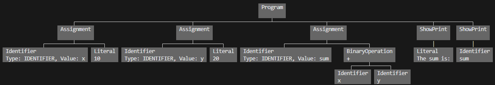

# PoliteLang Compiler 🌟

Welcome to the **PoliteLang Compiler** repository! This project is part of the **CPT316 – Programming Language Implementation and Paradigms** course at Universiti Sains Malaysia (Semester 1, Academic Session 2024/2025). The compiler is designed for a beginner-friendly programming language called **PoliteLang**, emphasizing clarity, structure, and a touch of "politeness" in its syntax.

---

## 📚 Project Overview

The PoliteLang Compiler is a **three-phase compiler** handling:

1. **Lexical Analysis**: Tokenizes the source code into meaningful tokens.
2. **Syntax Analysis**: Parses tokens and constructs an Abstract Syntax Tree (AST).
3. ~~**Semantic Analysis**: Ensures type consistency and validates program semantics.~~ (Canceled from the assignment and no longer needs to be done)

This project is based on the **MiniLang** language as described in the assignment, but we have named it **PoliteLang** to reflect its unique syntax that emphasizes politeness and readability. PoliteLang uses keywords like `pls` and `thanks~` to make coding more approachable and fun.

---

## 🛠️ Features

- **Polite Syntax**: Keywords like `pls` and `thanks~` emphasize politeness in code.
- **Expressive Constructs**:
  - Output commands (`show`, `whisper`, `shout`)
  - Control flow (`Check`, `During`, `Given`)
  - Variables and expressions
- **Error Handling**:
  - Lexical errors: Unrecognized symbols or malformed tokens.
  - Syntax errors: Missing semicolons, mismatched parentheses.
  - ~~Semantic errors: Undeclared variables, type mismatches.~~
- **Abstract Syntax Tree (AST)** visualization for debugging using the PrettyPrintTree library

---

## 📋 Language Specification

### Example Program

```python
pls score = 10 thanks~
pls name = "Polite Programmer" thanks~
check (score > 5) {
    shout("High score!") thanks~
} otherwise {
    whisper("Keep trying...") thanks~
}
```

### Keywords

- `pls`, `thanks~`, `show`, `whisper`, `shout`, `check`, `otherwise`, `during`, `given`

### Comments

- Use `:)` for single-line comments:
  ```plaintext
  :) This is a friendly comment
  ```

For more details, see the [Requirement.md](./Requirement.md) file.

---

## 🖥️ Repository Structure

- **`lexical.py`**: Implements the tokenizer to break source code into tokens.
- **`main.py`**: Integrates the compiler phases and provides a CLI for testing (this is where the code will be run and call other functions).
- **`Requirement.md`**: Comprehensive specification of PoliteLang.
- **Test-Cases**:
  - `valid-test-case-1`:
    A basic PoliteLang program showcasing variable assignments and arithmetic operations, free of lexical and syntax errors.
  - `invalid-test-case-1`:
    A PoliteLang program with lexical or syntax errors, such as unrecognized symbols, missing semicolons, or misused parentheses.
  - `sample-test-case(testing purpose)`:
    Sample test case for validating variable assignment, output, and conditional statements in PoliteLang while developing the code.

---

## 🚀 How to Use

1. **Clone the repository**:

   ```bash
   git clone https://github.com/JackyChung2003/CPT316-G29-Assignment-1
   cd CPT316-G29-Assignment-1
   ```

2. **Install Dependencies**:
   Ensure you have Python (version 3.7 or later) installed. Then, install the required `PrettyPrintTree` library:

   ```bash
   pip install PrettyPrintTree
   ```

3. **Run the Compiler**:

   ```bash
   python main.py
   ```

4. **Choose a Test Case**:

   - When prompted, input the number corresponding to your test case:
     - **1** for `invalid-test-case-1.txt`
     - **3** for `valid-test-case-1.txt`
   - After typing the number, press **Enter** to proceed.

5. **View Output**:
   - Lexical Analysis: Tokenized breakdown of the program.
   - Syntax Analysis: Generated AST or error details.

---

## 🔍 Examples

### Valid Test Case 1

**Source Code**:

```plaintext
pls x = 10 thanks~
pls y = 20 thanks~
pls sum = x + y thanks~
show("The sum is:") thanks~
show(sum) thanks~
```

**Lexical Analysis Output**:

```
Type: KEYWORD, Value: pls
Type: IDENTIFIER, Value: x
...
Type: END_STATEMENT, Value: thanks~
```

**Syntax Analysis Output**:

```
Assignment() Identifier(Type: IDENTIFIER, Value: x) Literal(10)
Assignment() Identifier(Type: IDENTIFIER, Value: y) Literal(20)
...
ShowPrint() Identifier(Type: IDENTIFIER, Value: sum)
```

**🖼️ Sample Picture of AST**



---
